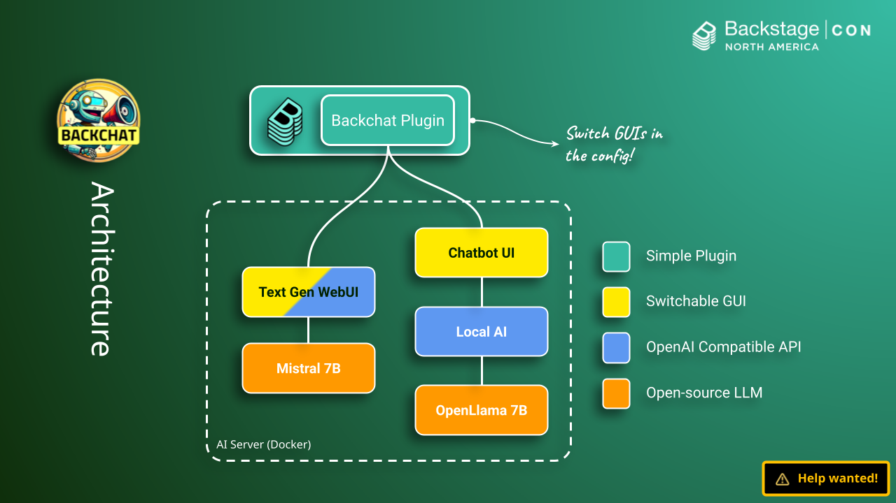
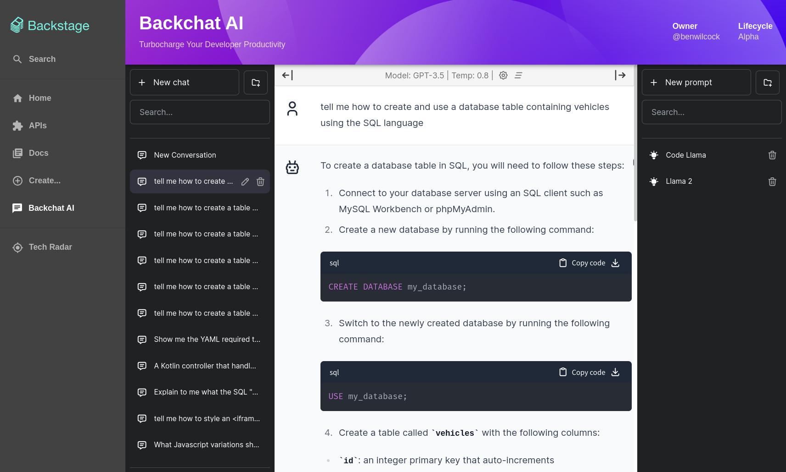
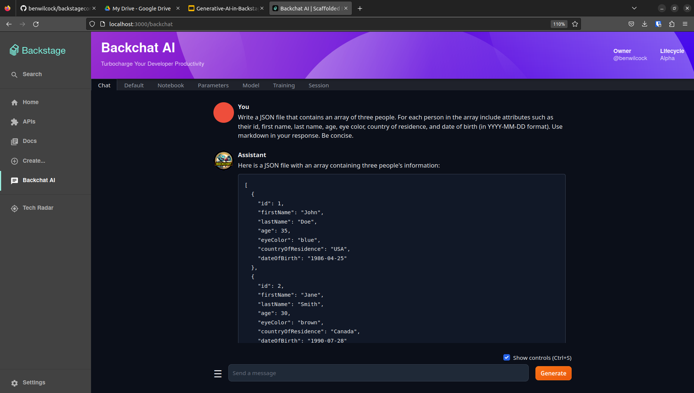

# Backstage Plugin Backchat

I should apologize in advance - _this is such a rotten hack_ - but as a simple **proof of concept** for private AI in Backstage, it kinda works!

__I'd love some help to turn it into something more. Please feel free to contact me directly on [LinkedIn](https://www.linkedin.com/in/benwilcock/) or GitHub if you'd like to contribute!__

<figure><figcaption>The Backchat plugin architecture.</figcaption></figure>

## Installing The Plugin

Follow the steps below to get the plugin installed into your Backstage instance. I wrote this plugin against Backstage v1.18.4.

## Prerequisites

Here's what you will need before you get started:

* A Backstage instance (follow [this guide](https://backstage.io/docs/getting-started/))
* Docker, LocalAI and ChatbotUI (clone [this](https://github.com/benwilcock/backstagecon-2023) project for a `docker-compose.yaml`)
* Lots of patience.

## Step 1. Create A Backstage Instance

If you don't have a backstage instance yet, create one using the instructions [here](https://backstage.io/docs/getting-started/).

At the time of writing, the command that you need to do this is:

```bash
# Only works if you installed all the pre-requisites the command needs!
npx @backstage/create-app@latest
```

The Backstage installer will start. When prompted, choose a name for you instance, like `my-instance`.

## Step 2. Add The AI Server Config To Backstage

Create a local configuration file.

```bash
cd my-instance
touch app-config.local.yaml
```

Add the following config to your new `app-config.local.yaml` file:

```yaml
# Mandatory: Choose one URL to incorporate, either ChatbotUI or TextGenWebUI.
ai_server:
  url: "http://localhost:3001" # Specifies where to find the ChatbotUI GUI
  #url: "http://localhost:7860" # Specifies where to find the Text Generation WebUI

# Optional: You can also load this Backstage catalog that contains a system diagram and techdocs for Backchat.
catalog:
  locations:
    - type: url
      target: https://github.com/benwilcock/backstagecon-2023/blob/main/backchat-catalog.yaml
  rules:
    - allow: [Component, API, Resource, System, Domain, Location, Group, User]
```

## Step 3: Start The AI Server

Clone [this project](https://github.com/benwilcock/backstagecon-2023) somewhere other than the backstage instance folder and read through the [README](https://github.com/benwilcock/backstagecon-2023/blob/main/README.md) file. A small amount of configuration and setup is required.

> This project uses `docker compose` to run a couple of large language model servers and a user interfaces where you can chat locally (and privately) to an open-source AI at zero cost. The speed of this solution is very much hardware dependant. If you're running Backstage and an LLM locally at the same time, make sure you have plenty of RAM and be very patient. If you have a separate server with CUDA, these servers can be reconfigured to make use of it.

Once you have configured and started the AI servers in Docker, you can check the ChatbotUI GUI is available by pointing your browser at [http://localhost:3001](http://localhost:3001), and that Text Gen Web UI is available by pointing your browser at [http://localhost:7860](http://localhost:7860).

> Tip: If you don't want to run your own AI servers locally then why not try [RunPod](https://www.runpod.io/)? RunPod offers a whole bunch of [ready to run community templates](https://www.runpod.io/console/templates) with a broad selection of different hardware configurations. Just be mindful of how this choice may impact your data security and privacy before you make your decision. 

## Step 4: Add The Backchat Plugin To Your Backstage Instance

Use the `yarn add` command to add the plugin to your Backstage instance.

```bash
cd my-instance
yarn add --cwd packages/app @benbravo73/backstage-plugin-backchat
```

Navigate to your `packages/app/src/App.tsx` and refactor to include the following declarations.

```typescript
import {BackchatPage} from '@benbravo73/backstage-plugin-backchat'
...
<FlatRoutes>
        ....
        <Route path="/backchat" element={<BackchatPage />} />
</FlatRoutes>
```

At this stage, you can already make the plugin appear in your browser at [http://localhost:3000/backchat](http://localhost:3000/backchat). But read on to complete the installation.

## Step 5: Add The Backchat Feature To Your Backstage Navigation Menu

To integrate your plugin with the rest of the UI, you need to add an entry into the side navigation.

In the file `packages/app/src/components/Root/Root.tsx` add an import for the "Chat" icon and a sidebar item for "Backchat AI" like this:

```javascript
...
// With the other icon imports at the top of the file.
import ChatIcon from '@material-ui/icons/Chat';
...

...
// With the other SidebarItem's under the "Menu" SidebarGroup.
<SidebarItem icon={ChatIcon} to="backchat" text="Backchat AI" />
...
```

Upon reloading of Backstage you should now see a new sidebar item for "Backchat AI". Click this link to open the Backchat feature within Backstage.

## Tips

As you have a choice of which AI system you integrate using Backchat, here is some information to help you decide.

### ChatBot UI and LocalAI Server

ChatBotUI and LocalAI has a nice look and feel. The ChatbotUI project is a bit dated now and the LocalAI server can be a challenge to understand when it comes to model loading and swapping, but overall the combination looks great for PoCs.

<figure><figcaption>Exposing <a href="https://github.com/mckaywrigley/chatbot-ui">ChatBotUI</a> in the Backstage GUI.</figcaption></figure>

### Text Generation Web UI (GUI and Server)

The Text Gen Web UI has a lot of features - which can make it seem daunting at first. But, the "chat" features is very simple to use and it has a great model download / load workflow and works well with Mistral. Just don't for get to "Load" your model before starting your chat session.

<figure><figcaption>Exposing <a href="https://github.com/oobabooga/text-generation-webui">Text Gen Web UI</a> in the Backstage GUI.</figcaption></figure>

## And Finally...

Enjoy the Backchat plugin and the **private** conversations you have with your AI! Don't forget to star this repo on GitHub and follow me on [LinkedIn](https://www.linkedin.com/in/benwilcock/) so you'll be notified when I post new content.

## Roadmap

What I'd really like to do is to transform this Backchat plugin into a fully integrated OpenAI API client, but I need your help. Interested? Contact me directly on [LinkedIn](https://www.linkedin.com/in/benwilcock/) or GitHub if you'd like to contribute!

## Bonus

You can run the plugin in isolation for testing.

```bash
yarn start # Starts the plugin in standalone mode for testing
```

> Note to self: I added some bash scripts to remind me of some common commands required after cloning this repo.

## Alternatives?

Don't like this approach? Already a ChatGPT subscriber? Why not try [this plugin from Enfuse](https://github.com/enfuse/backstage-chatgpt-plugin/blob/main/README.md) instead?